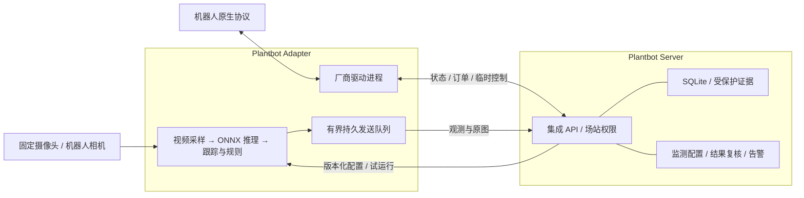

# Vision monitoring in Events / 事件中的视觉监测

[中文](#中文) · [English](#english)

## 中文

视觉能力属于 **Plantbot Adapter**。Server 保存配置、试运行、观测和证据，并将异常转为既有事件。Server 不加载模型；机器人驱动和视觉进程独立运行、独立重启。已有托管连接器保持兼容，新部署可以把 Adapter 安装在机器人和摄像头所在网络。



### 11 项预置能力

| 能力 | 判断方法 | 必须配置 |
| --- | --- | --- |
| 人数统计 | 区域内当前人数 | 区域、置信度 |
| 越线检测 | 跟踪目标穿过有限线段，按方向累计 | 区域、计数线、方向 |
| 禁区入侵 | 区域人数超过阈值并持续指定时间 | 区域、人数阈值（默认 0）、持续时间 |
| 人群聚集 | 人数超过配置阈值并持续指定时间 | 区域、人数阈值、持续时间 |
| 离岗检测 | 人数低于要求并持续指定时间 | 岗位区域、人数、时段、持续时间 |
| 人员滞留 | 同一跟踪目标持续停留 | 区域、持续时间 |
| 在岗监测 | 按班次监测岗位人数是否满足要求 | 岗位区域、人数、时段、持续时间 |
| 车辆计数 | car / bus / truck 穿越计数线 | 区域、计数线、方向 |
| 违停检测 | 车辆在区域内保持近似静止 | 区域、持续时间 |
| 显示屏 OCR | 识别中英文/数字；可严格解析单值 | 显示区域、单位、可选上下限 |
| 危险区域滞留 | 同一人员在危险区域内超时 | 区域、持续时间 |

人数统计与车辆计数只产生观测；其余异常生成 `vision-<preset>` 事件。离岗与在岗共享人数规则，区别在岗位和班次配置；人员滞留与危险区域滞留共享时间规则，区别在检测区域和告警等级。无需为每个名称部署一个模型。

### 组件与模型

- **ONNX Runtime 1.29.0**：统一 CPU 推理，默认 2 个计算线程，不依赖 PyTorch、Paddle 或在线推理服务。
- **RT-DETRv2 R18vd**：COCO 预训练的人车检测器，固定输入 640×640，复用检测结果。权重来自 `onnx-community/rtdetr_v2_r18vd-ONNX` 的固定提交 `936f90b6a476c6da4dfe053fc521af55285976ba`。
- **ByteTrack**：`trackers 2.6.0` 与 `supervision 0.30.2` 提供跟踪数据结构；规则按采集时间运行，区域使用归一化坐标，人数/人车区域判断使用检测框底边中心。
- **RapidOCR 3.9.2 / PP-OCRv5 mobile**：独立检测/识别文字，读取实际显示字符；不把 `O` 猜成 `0`，多值或低置信度记为未知。

模型随 Adapter 镜像交付。构建时根据 [`models.lock.json`](../integrations/vision/models.lock.json) 下载并校验 SHA-256，运行时再次校验并禁止隐式下载。依赖精确版本见 `requirements.lock.txt`。来源及许可证见 [`THIRD_PARTY.md`](../integrations/vision/THIRD_PARTY.md)。这些是通用预训练能力，现场准确率仍需用实际摄像机画面验收；目前不包含专用工程车辆、身份识别、PPE、火焰或热成像测温。

### 配置与使用

1. 按 [release.md](release.md) 启动 Server，建立场站并创建该场站 API key。
2. 在 Adapter 的 `adapter.json` 中设置 `serverUrl`（包含 `/robots` 等部署前缀）、唯一 `id`、`sources`；密钥放在 `.env.adapter` 的 `PB_SITE_KEY`。`devices` 可为空，因此普通固定摄像头无需假装成机器人。
3. 启动 Adapter，在 **事件 → 监测规则** 中选择预置能力和视频源。先试运行获取原图，拖动区域顶点/计数线，或用键盘方向键调整。设置阈值、持续时间、班次与设备关联，保存后启用。
4. 在规则详情的观测记录中查看配置版本、模型版本、读数、原图及标注；正常观测不挤占事件列表。异常事件保留触发时的配置快照和观测 ID，改名、改版或删除配置不会重写历史。视频页只按明确的通道绑定打开同一编辑器，不推测视频源。试运行最多观察 40 秒，60 秒过期，不生成正式事件。超过试运行窗口的时长条件需要正式运行验证。

配置名称不决定逻辑，`preset` 和参数才决定逻辑。区域边界包含在区域内。越线仅计算穿过线段的轨迹，线附近有防抖区；计数是本次连续观测以来的累计值，重连、视角变化和规则修改后重置。违停以图像宽高归一化后约 2.5% 的位置变化作为重置条件，需要用现场机位验证容差。班次使用 UTC，支持跨午夜；开始与结束时间相同表示全天。

固定视角是连续规则的前提。移动机器人或运动中的云台不能用于连续人数/越线/停留判断。画面发生明显平移、旋转、缩放、黑屏或中断时，推理暂停并重置规则；图像运动检查只是额外保护，不能替代正确的固定机位配置。`view: mobile` 仅支持 OCR，必须指定设备驱动写入的 `stationaryFile`，内容为 `{"stationary":true,"observedAt":<Unix毫秒>}`，有效期 2 秒。没有可信停稳反馈时不读取。云台巡检目前不会自动触发 OCR；可通过试运行 API 显式触发，并保留这个能力边界。

### 真实录像演示

v2.5.1 的 [Adapter Demo](demo.md) 使用两条独立循环的录像：MEVA 安防训练场楼梯通行画面约 30 秒，InspecSafe 煤廊原始 IR 画面 13.28 秒。前者由 RT-DETRv2 和 ByteTrack 检测、跟踪实际人物；后者由 RapidOCR 读取相机原生最高温叠字约 31.1–34.3℃。OCR 示例只框选右上角读数，启用单值解析，单位使用画面实际字符 `℃`（U+2103），上限为 33。

热像中的热点包括人物，33℃ 是演示阈值，不是现场报警标准；读出文字不等于确认某台设备温度，也不提供从伪彩像素反算辐射温度的能力。MEVA 的禁区由演示规则指定，不表示训练录像中的人物实际违规。人物遮挡、远距小目标、视角变化、预热和循环边界均可能影响有效观测，原有 ViewGuard 与未知/失败语义照常执行。录像中的人物漏检不能以预写计数补齐。

演示 worker 解码本地原始 MP4，执行实际模型和规则，再通过集成 API 上传观测与原图；RTSP 播放同一份文件但与采样不逐帧同步。正常人数观测不创建事件，试运行也不创建正式事件；正式 OCR/入侵异常才进入事件中心。恢复观测与人工处置分别记录。文件来源、许可、加工步骤及逐项语义边界见[演示素材](demo-media.md)。

### 可靠性与访问控制

- 一个场站内同名 Adapter 只有一个有效运行实例；每 3 秒心跳续期，租约 15 秒失效。Server 重启后令牌全部失效，Adapter 自动重连。
- 配置写入使用 `revision` 乐观并发控制；旧版本和已停用配置的上报被拒绝。试运行冻结当时配置。
- 结果 ID 幂等。当前告警按正常/异常变化产生，未知和失败不代表恢复。延迟超过 60 秒的观测只归档，不触发当前事件。
- 本地 SQLite 发送队列最多 128 条或 64 MiB，先到上限即丢弃最旧记录并记日志；它是有限断网缓冲。服务端保留 7 天观测，证据默认 1 GiB 周期清理预算（`PB_VISION_MAX_MB`，128–8192 MiB），不是硬磁盘配额。
- admin 配置和启停，operator 试运行，viewer 查看；证据沿用场站访问控制和 `PB_PUBLIC_VIEW`，没有旁路静态下载地址。相机 URL 与凭证只在 Adapter 配置中，心跳不包含它们。
- 推理进程默认 2 CPU / 2 GiB；与机器人驱动进程分离。推理循环 60 秒无进展会退出，由 Compose 重启；不会发出任何机器人运动命令。高负载导致采样间隔超过 3 秒时重置时间规则，避免把缺帧时间算入停留。

### 开发与验收

```bash
python3.12 -m venv integrations/vision/.venv
integrations/vision/.venv/bin/pip install -r integrations/vision/requirements.lock.txt
integrations/vision/.venv/bin/python integrations/vision/setup_models.py
PB_ADAPTER_CONFIG=/path/adapter.json PB_SITE_KEY=pbk_... \
  integrations/vision/.venv/bin/python integrations/vision/worker.py
pnpm --dir integrations exec tsx runtime.ts # 同样读取 PB_ADAPTER_CONFIG / PB_SITE_KEY
integrations/vision/.venv/bin/python -m unittest discover -s integrations/vision/tests -v
pnpm --dir integrations exec tsx --test test/vision.e2e.ts
WEB_BASE=/robots/ pnpm build
node scripts/test-vision-ui.mjs
PB_UI_BROWSER=firefox node scripts/test-vision-ui.mjs
PB_UI_BROWSER=webkit node scripts/test-vision-ui.mjs
```

测试包含 11 项确定性规则、真实权重检测与 OCR、视角变化和黑屏、服务端权限/重放/版本/重启，以及真实 Adapter + 子路径生产前端的浏览器操作。录像解码、模型输出、RTSP 播放与完整包运行分别验证；固定录像的成功不等于特定工厂的误报率或所有机位的可用性承诺。

## English

Vision is an optional capability of **Plantbot Adapter**. Server stores versioned configurations, previews, observations and protected evidence, and raises events through its existing event system. Vendor drivers and vision run independently. Existing managed connectors remain supported.

The eleven presets cover people counting, boundary crossing, restricted-area intrusion, crowd gathering, absence from post, personnel loitering, post occupancy, vehicle counting, illegal parking, display OCR and hazard-zone dwell. Ten presets share RT-DETRv2 R18vd detection and ByteTrack tracking; OCR uses RapidOCR with PP-OCRv5 mobile. CPU inference uses ONNX Runtime. Pinned model files and dependency versions are included in the Adapter package; runtime does not download models.

Configure `serverUrl`, a unique adapter `id`, video `sources` and optional robot `devices` in `adapter.json`; keep `PB_SITE_KEY` in `.env.adapter`. Sources remain local to the Adapter. In **Events → Monitoring rules**, choose a preset, run a preview, adjust the normalized region or counting line, configure thresholds and an optional UTC schedule, then enable monitoring. Evidence review supports original images, detection overlays and download. Asset association links observations to equipment without moving protocol credentials into Server.

Continuous rules require fixed views. Large camera motion, unusable frames, disconnection and excessive observation gaps reset tracking and duration state. Mobile sources support OCR only and require a driver-produced `stationaryFile` with `stationary: true` and `observedAt` in Unix milliseconds, no more than two seconds old. Image motion checks supplement this requirement; they do not guarantee camera pose. PTZ patrols do not automatically invoke OCR.

Configuration writes require admin; previews require operator; results follow existing site viewer permissions. Previews run for up to 40 seconds, expire after 60 seconds and do not raise production alarms. Unknown or failed observations never mean recovery. Results received over 60 seconds late are archived without raising current alarms. Numeric OCR accepts one unambiguous value within the configured ROI; no character substitution is applied.

The Adapter uses an exclusive 15-second lease, reconnects automatically, and retries immutable observation IDs through a bounded SQLite outbox (128 records or 64 MiB, oldest discarded with a warning on overflow). Server retains observations for seven days and periodically trims evidence to `PB_VISION_MAX_MB` (default 1024 MiB). Keep deployment secrets and data volumes when upgrading. Detection confidence, sample rate and scene suitability must be validated against site footage; the bundled models do not provide a site-specific accuracy guarantee.

The v2.5.1 Demo uses a real MEVA security-training stairwell recording and an original InspecSafe infrared inspection video. OCR reads the camera's maximum-temperature text (approximately 31.1–34.3℃), with `℃` as the exact unit and 33 as an illustrative upper limit. A person contributes to the hotspot; this is neither equipment-overheat diagnosis nor radiometric measurement from pixel colours. The worker performs actual decoding and inference on the local MP4, while a separate RTSP loop supplies playback. No results are injected from the manifest. Scene suitability, missed small targets and unusable frames remain visible in observations. See [the media guide](demo-media.md) for original sources, transformations and licensing.

See the commands above for local setup and tests, [release.md](release.md) for deployment, and [OpenAPI](openapi.yaml) for the integration contract.
